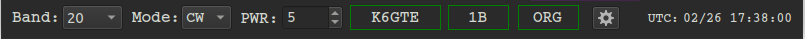
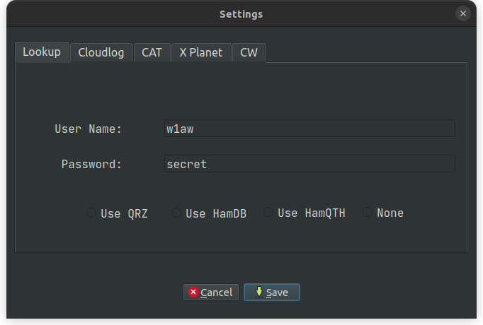
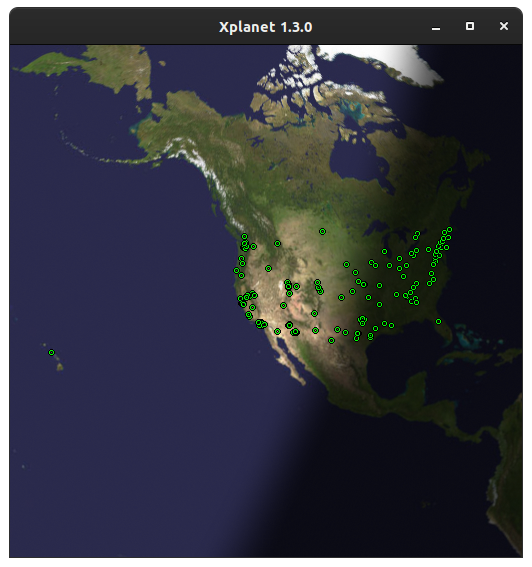
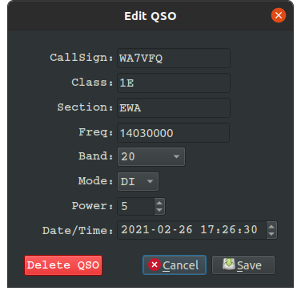
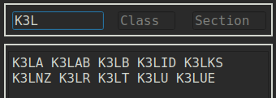
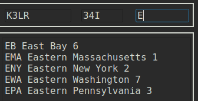
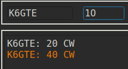
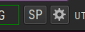
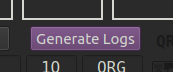

# K6GTE Field Day logger

## Caveats

This is a simple logger, although it's getting less and less simple as the days pass, ment for single op/station. It will not aggregate contacts made by multiple stations.

This has always been a "scratch my own itch" project. And the development of it is driven by that. However, I welcome suggestions, criticisms and feature requests.

Field Day only has a generic digital mode designator 'DI', which gets exported 
to the cabrillo file. But ADIF and CloudLog needed something else, So I Chose 
FT8. Yes Yes, I know. FT8 is the spawn of Satan, and is killing Ham Radio... 
Blah Blah Blah... Feel free to change it to what ever you will use. Just search for the two places in the code 'FT8' is used and Bob's your dads brother.

---
## Wheres the data

The log is stored in an sqlite3 database file './FieldDay.db'. If you need to 
wipe everything and start clean, just delete this file and re-run the logger.

The logger will generate a cabrillo file './YOURCALL.log' and a './Statistics.txt' 
file with a band/mode/power breakdown which you can use when you submit your 
logs to the ARRL online [here](http://field-day.arrl.org/fdentry.php). 

An ADIF file './FieldDay.adi' will also be generated so you can merge contacts into your normal Log.

---
## Running from source

Install Python 3, then two required libraries.

If you're the Ubuntu/Debian type you can:

`sudo apt install python3-pyqt5 python3-requests python3-bs4`

You can install libraries via pip:

`python3 -m pip3 install -r requirements.txt`

Just make fielddaylogger.py executable and run it within the same folder,
or type:

`python3 fielddaylogger.py`

---

## What to do first

When run for the first time, you will be greeted by a dialog asking for your Callsign, Class and Section. Afterward, there is a gear icon on the main screen, where you can change your CAT, CW interface, callsign lookup service etc. You can also change your call class and section by clicking on the respective fields.





---
# Features

## Logging

Okay you've made a contact. Enter the call in the call field. As you type it in, it will do a super check partial (see below). Press TAB or SPACE to advance to the next field. Once the call is entered and you've moved to the next field, it will do a DUP check (see below). It will try and Autofill the next fields (see below). When entering the section, it will do a section partial check (see below). Press the ENTER key to submit the contact to the log.

If it's a busted call or a dup, press the ESC key to clear all inputs and start again.

---
## Radio Polling with CAT

If you run flrig or rigctld on a computer connected to the radio, it can be polled for band/mode updates automatically. Click the gear icon at the bottom of the screen to set the IP and port and choose flrig or rigctld. The default ports are 4532 for rigctld and 12345 for flrig.  There is a radio icon at the bottom of the logging window to indicate polling status. Green good, Red bad.

---
## Cloudlog useage

If you use [CloudLog](https://github.com/magicbug/Cloudlog) for your main logging you can click the gear icon to enter your credentials. Contacts are pushed to CloudLog as soon as they are logged.

---
## QRZ, HamDB or HamQTH

The QRZ/HamDB/HamQTH lookup is only used to get the name and gridsquare for the call. Mainly because when a contact is pushed to [CloudLog](https://github.com/magicbug/Cloudlog) it will not show as a pin on the map unless it has a gridsquare. So this is a scratch my own itch feature.

The call to the lookup service is made anytime you exit the call entry field 
by pressing a TAB or Space key. This call is done in it's own thread so it will 
not slow down the GUI interface.

Distance and bearing to contact is also calculated at this time, though I 
haven't made use of the data. 

---
## XPlanet marker file

If you use QRZ/HamdDB lookups you can also generate an 
[XPlanet](http://xplanet.sourceforge.net/) markerfile which will show little 
pips on the map as contacts are logged.



The above launched with an example command:

```bash
xplanet -body earth -window -longitude -117 -latitude 38 -config Default -projection azmithal -radius 200 -wait 5
```

---
## Editing an existing contact

Double click a contact in the upper portion of the screen to edit or delete it.



---
## Super Check Partial

If you type more than two characters in the callsign field the program will 
filter the input through a "Super Check Partial" routine and show you possible 
matches to known contesting call signs. Is this useful? Doubt it.



---
## Section partial check

As you type the section abbreviation you are presented with a list of all 
possible sections that start with what you have typed.



---
## DUP checking

Once you type a complete callsign and press TAB or SPACE to advance to the next 
field. The callsign is checked against previous callsigns in your log. It will 
list any prior contact made showing the band and mode of the contact. If the 
band and mode are the same as the one you are currently using, the listing will 
be highlighted, the screen will flash, a bell will sound to alert you that this 
is a DUP. At this point you and the other OP can argue back and forth about 
who's wrong. In the end you'll put your big boy pants on and make a decision if 
you'll enter the call or not.



---
## Autofill

If you have worked this person before on another band/mode the program will 
load the class and section used previously for this call so you will not have 
to enter this info again.

---
## CW Macros

The program will check in the current working directory for a file called 
`cwmacros_fd.txt`. If not present it will be created. It will parse the file
and configure the row of 12 buttons along the bottom half of the window.
The macros can be activated by either pressing the corresponding function key,
or by directly clicking on the button. You can check the file to glean it's 
structure, but it's pretty straight forward. Each line has 4 sections separated
by the pipe `|` character. 
Here's an example line.

`R|F2|Run Exch|{HISCALL} {MYCLASS} {MYSECT}`

The first field is an `R` if the macro is to be shown while in Run mode.
Otherwise an `S` for Search and Pounce. The second field is the function key
to program. The third is the text label to put in the button. Lastly the
fourth is the text you would like to send.

A limited set of substitution macros are offered.

`{MYCALL}`
`{HISCALL}`
`{MYCLASS}`
`{MYSECT}`

These are pulled straight from the onscreen input fields. Combined with normal
text this should have you covered for most of your exchange needs.

---
## CW Macros (Run vs S&P)

You can toggle the macros in use between Run and Search and Pounce by clicking
the button to the left of the settings/gear button at the botton right portion
of the screen.



This can also be used to reload the macros if you edit them while the program
is running.

---
## CWDAEMON speed changes.

If you use cwdaemon for your cw macro sending, you can press the PageUp and 
PageDown keys on your keyboard to increase/decrease the cw sending speed.
You can press `ESC` to abort CW output.

---
## When the event is over

After the big weekend, once you've swept up all the broken beer bottles and 
wiped the BBQ sauce off your chin, go ahead and click the Generate Logs button.



This will generate the following:

An ADIF log 'FieldDay.adi'.

A Cabrillo log 'Yourcall.log'. Which you edit to fill in your address etc. 
If your not using Windows, you must ensure whatever editor you use uses CR/LF 
line endings. Cause whatever they use at the ARRL will choke with out them. 
To be safe you might want to run it through 'unix2dos' before submitting it.

A 'Statistics.txt' file which breaks down your band/mode/power usage.

---
## The Bandmap program
See [here](bandmap.md)
