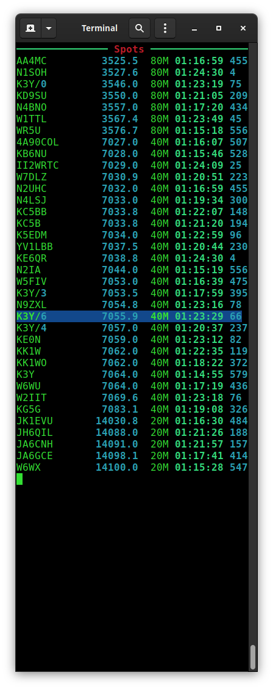

# Bandmap

## What is it?
I've written what can be considered a companion application. It's not new, or novel, and certainly not attractive. It's a terminal application. But I needed one, and I wanted it to do specific things. At it's heart, it's main feature is showing RBN spots for CW.

## Features
* It polls the RBN site for active spotting servers. Gets the gridsquare of those servers, and compares it to your gridsquare. It then calculates the distance to each server from you, and builds a lists of those servers. This way you can define a listening radius. There is no real benefit to looking at spots from a server in Norway if you're in South Texas.
* If you have flrig setup it will highlight spots near your VFO.
* It can look at your active Field Day log and highlight those spots you have already worked, so you can focus on other stations.
* You can give it a list of bands you wish it to cover. No use in seeing spots on 160 if you don't have an antenna for 160.
* It will dynamically resize and prune the list of spots if they don't fit in the window, tossing the oldest ones.
* It can limit the returned spots to those in the general portion of the band. No use in cluttering the screen with spots you're not allowed to work if you're not an Extra/Advanced class.

## Command line options
```
  -h, --help            show this help message and exit
  -c CALL, --call CALL  Your callsign
  -m MYGRID, --mygrid MYGRID
                        Your gridsquare
  -d DISTANCE, --distance DISTANCE
                        Limit to radius in miles from you to spotter, default
                        is: 500
  -g, --general         Limit spots to general portion of the band.
  -a AGE, --age AGE     Drop spots older than (age) seconds. Default is: 600
  -r RBN, --rbn RBN     RBN server. Default is: telnet.reversebeacon.net
  -p RBNPORT, --rbnport RBNPORT
                        RBN server port. Default is: 7000
  -b BANDS [BANDS ...], --bands BANDS [BANDS ...]
                        Space separated list of bands to receive spots about.
                        Default is: 160 80 40 20 15 10 6
  -f FLRIGHOST, --flrighost FLRIGHOST
                        Hostname/IP of flrig. Default is: localhost
  -P FLRIGPORT, --flrigport FLRIGPORT
                        flrig port. Default is: 12345
  -l LOG, --log LOG     Log DB file to monitor. Default is: FieldDay.db
  ```
  
 So at the least you'd want to start it with options specific to you. I myself would use:
 `./bandmap.py -c K6GTE -m DM13AT -g`
 
 It can work with my other loggers. If you use the K1USNSST logger you can launch the bandmap with something like
`-l ~/SST.db`
tacked on the end, to have it monitor that log file.
 

 
## Requirements
It uses quite a few python libraries.
Some of which you will have to install. Usually with pip or a package manager.

`pip install Rich requests bs4 lxml`

Might be all you need.


